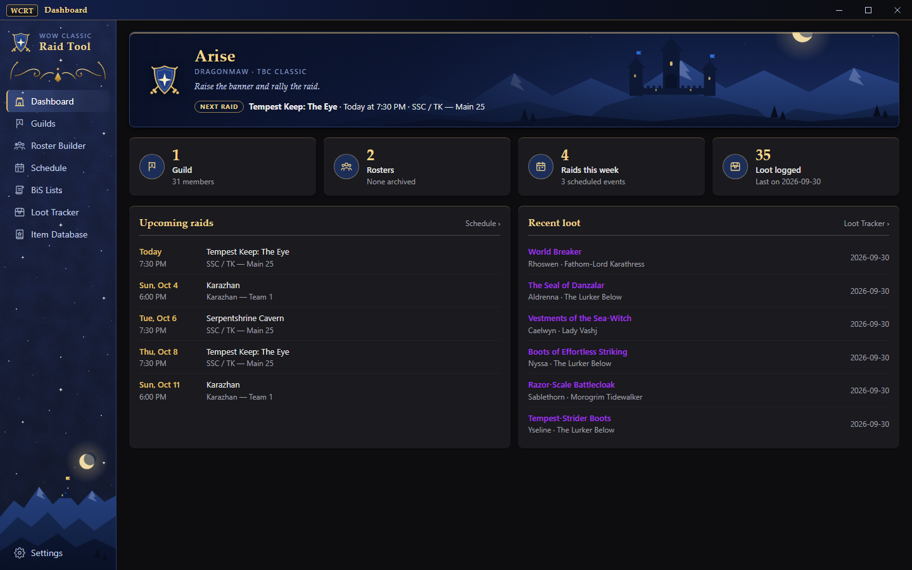
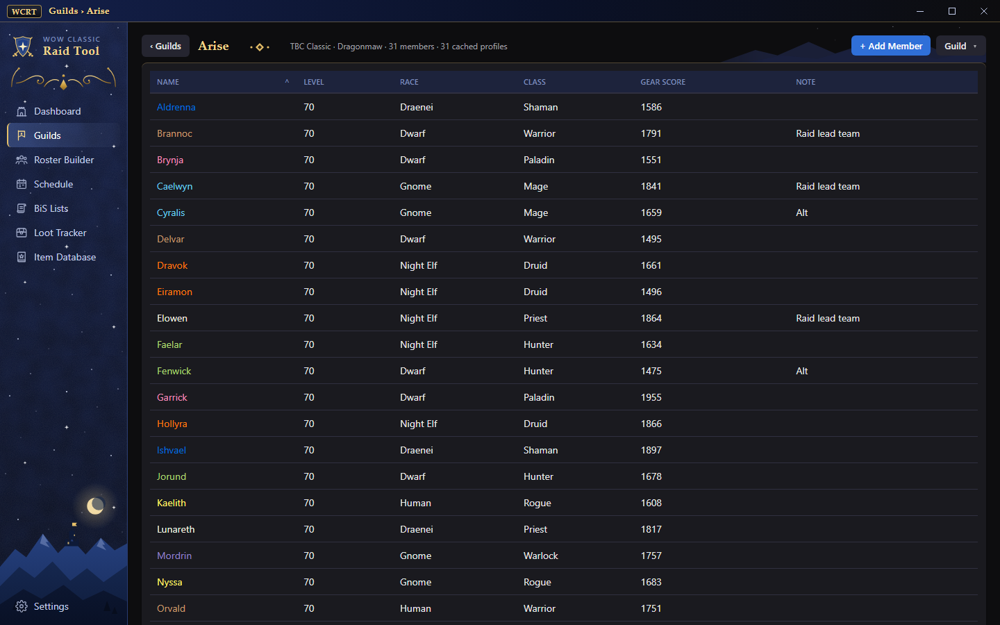
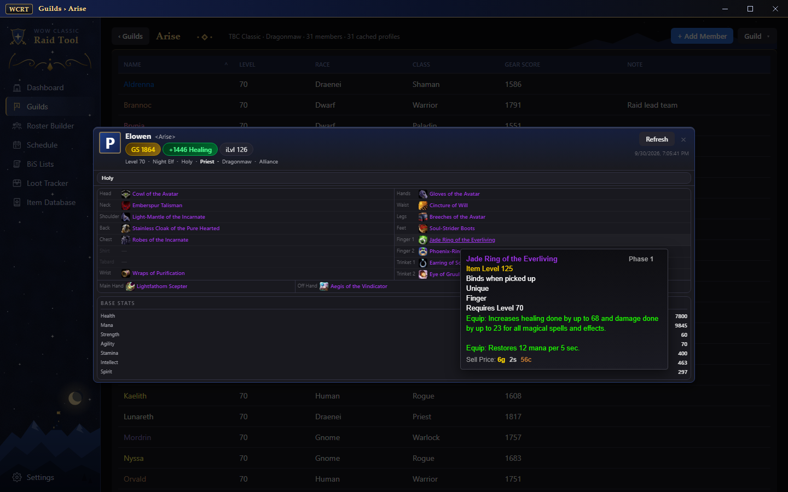
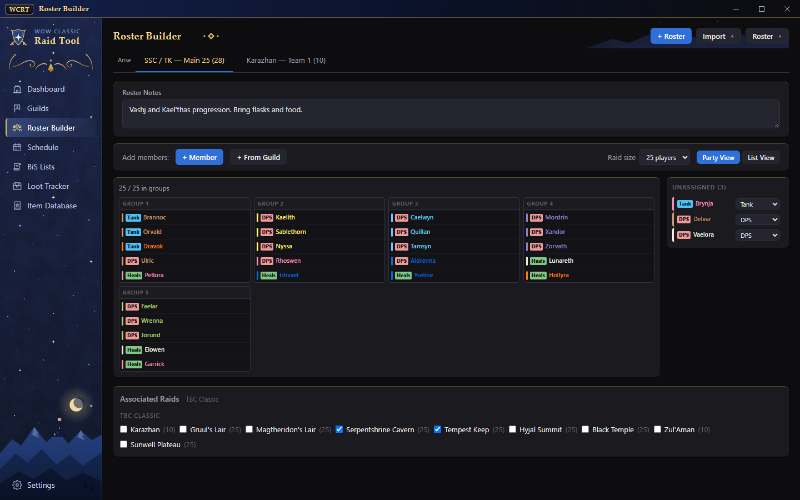
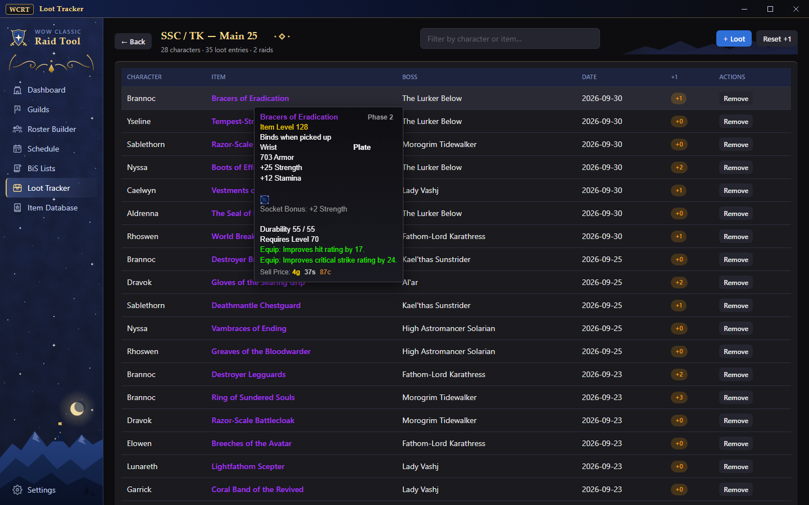
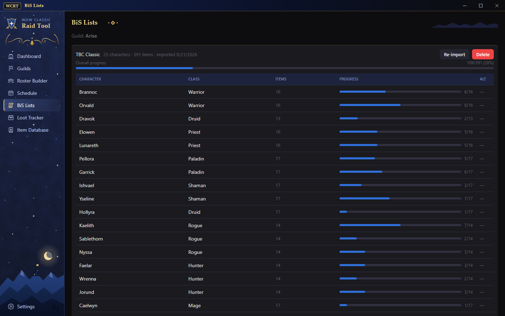
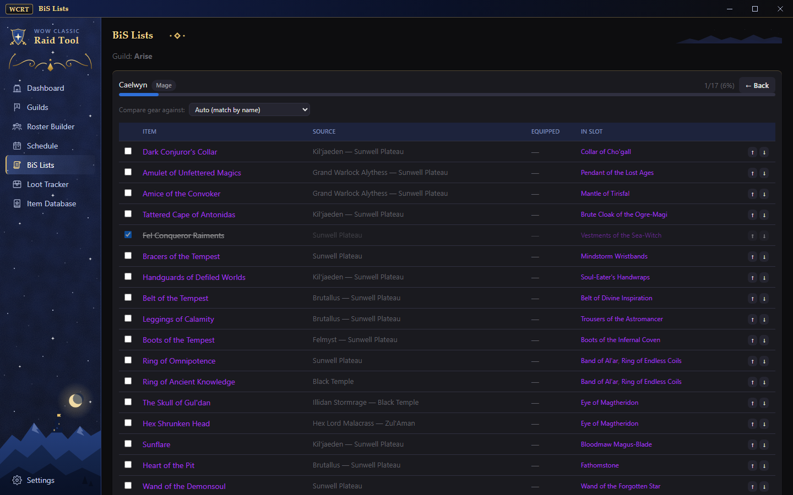
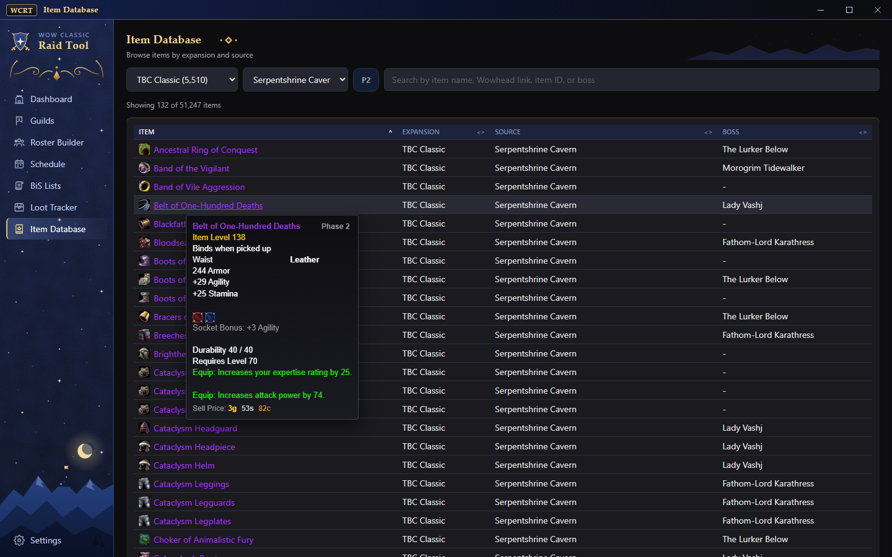
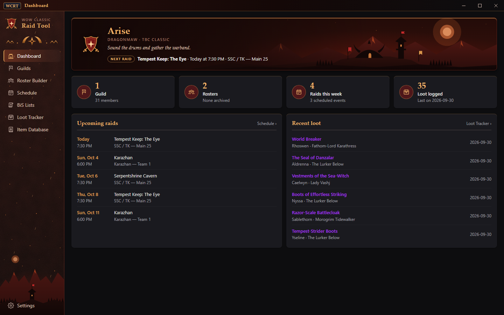

# WoW Classic Raid Tool

A Windows desktop app for World of Warcraft Classic raid leaders and planners. Keep your guild,
raid groups, raid schedule, BiS lists and loot log in one place, with a built-in item database
of real tooltips and icons that works offline.

Supports **Classic Era**, **Season of Discovery**, **Forever** (beta), **TBC**, **Wrath**,
**Cataclysm** and **Mists of Pandaria Classic**.

## Features

- **Guilds:** import your guild roster from Blizzard and see every member's class, level and
  Gear Score. Open a character sheet with their equipped gear, enchants and stats.
- **Roster Builder:** drag players into raid groups for 10, 20, 25 or 40-player raids. Keep a
  bench and notes, and link the roster to the raids it runs.
- **Schedule:** one-off or weekly raid nights. The Dashboard shows what's next.
- **BiS Lists:** import your guild's lists from That's My BiS and track everyone's progress
  against what they actually have equipped.
- **Loot Tracker:** log who got what from which boss, with a +1 system. Boss and item pickers come
  from the raids the roster runs.
- **Item Database:** 51,000+ items with full tooltips and icons, searchable by name, raid, boss or
  source: dungeons, raids, crafting, vendors, reputation, PvP and more.
- **Alliance or Horde:** a dark theme in your faction's colors and artwork.

## Screenshots

| | |
|---|---|
|  |  |
| **Guild:** members, classes and Gear Score | **Character sheet:** equipped gear with tooltips |
|  |  |
| **Roster Builder:** a 25-player raid in groups | **Loot Tracker:** the loot log with +1s |
|  |  |
| **BiS Lists:** the guild's progress | **BiS list:** each item against what's equipped |
|  |  |
| **Item Database:** filtered to Serpentshrine Cavern | **Horde theme** |

*The screenshots show an example guild with real TBC Classic items.*

## Install

1. Open the [latest release](../../releases/latest).
2. Download `WoW.Classic.Raid.Tool_<version>_x64-setup.exe` and run it. It installs for your
   Windows user only, so no administrator rights are needed.

Windows may show a SmartScreen warning because the installer isn't code-signed. Choose
**More info ▸ Run anyway**.

## Updates

The app checks for new versions when it starts and offers to install them. You can also check in
**Settings ▸ About & Updates**. Your data is kept when you update.

## Item data

The app's item database is also published on its own, for use in other tools:
[WoW-Classic-Item-Caches](https://github.com/Napalmsteak/WoW-Classic-Item-Caches).

---

This repository only holds the release downloads. The app's source code is private.
World of Warcraft and its item data © Blizzard Entertainment. This is an unofficial, fan-made tool.
